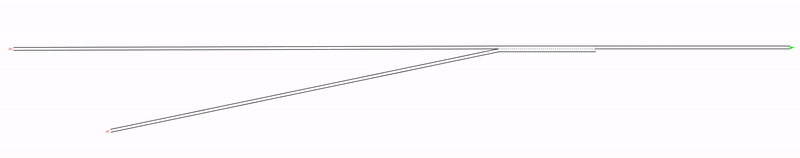

**| [Overview](#overview) | [Structure](#structure) | [Launching simulations](#launching-simulations) | [External tools](#external-tools) | [License](#license) | [Contact](#contact) |**

# ISTTT2019

**A hierarchical approach for splitting truck platoons near network discontinuities**

Aurelien Duret, Meng Wang, Andres Ladino

## Overview 

This repository contains source code used to generate the example in *"A hierarchical approach for splitting truck platoons near network discontinuities"* by [Aurelien Duret](https://www.researchgate.net/profile/Aurelien_Duret), [Meng Wang](http://mengwang.eu) and  [Andres Ladino](https://github.com/aladinoster). 

**No Control - Situation** 

 

**Control - Situation** 

## Structure 

- [Notebooks](notebooks): Contains the files to reproduce this results. 

## Launching simulations 


### Locally 

Locally you are able to reproduce this result and visualize the with case under *control* and the *uncontrolled* situation

```
git clone https://github.com/research-licit/ISTTT2019.git
```

## External tools

- [Jupyter Notebook](https://jupyter.readthedocs.io/en/latest/)
- Symuvia Libraries

## License

These notebooks are licensed under [MIT License]()

## Contact 

If you run into problems or bugs, please let us know by [creating an issue](https://github.com/research-licit/ISTTT2019/issues/new) an issue in this repository.